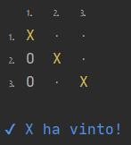
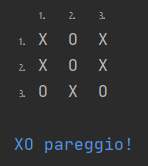

# Tris Console Game (Tic-Tac-Toe) 

This is a simple command-line implementation of the classic Tris (Tic-Tac-Toe) with an improved CLI graphics system.

## Getting Started
### Prerequisites
You will need to have Java 8+ installed on your computer to run this game.

### Installation
1. Clone or download this repository to your local machine.
2. Navigate to the project directory.
3. Compile the `Main.java` file by running the command `javac Main.java` in the terminal.
4. Run the game by entering the command `java Main` in the terminal.

## The Game
When you start the game the following menu appears on the home screen

>You can type '1' (classic game 3x3) or '2' (custom game max 20x20 with max 20 players) or '0' to exit

After choosing the type of game, the empty game grid appears waiting for the player’s turn (shown in blue)

To place your own symbol just enter the row and column number.

It is not possible to enter the symbol in an already occupied box or to enter values out of range 0 - N, where N is the number of rows or columns in the grid

#### The end of the game
- The winner is the one who places his symbol three times in line on the same row or column or on one of the two diagonals of the grid.
- Draw if no one has been able to align their symbol or finish the available grid spaces

 

### Feedback
If you have any feedback, please reach out to us at gurzau10@gmail.com

### License
[MIT](https://choosealicense.com/licenses/mit/)

