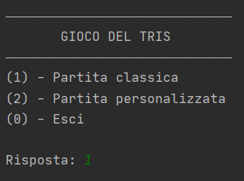
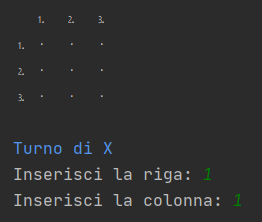

# tris-console-terminal
Java tris (tic-tac-toe) game using console terminal.

The project was created with the aim of creating something fun and more customizable.

To run the game you need to have:
- Versions after Java 8

## The Game
With command above you can already start the game and be taken to the initial screen of presentation

>You can type '1' (classic game 3x3) or '2' (custom game max 20x20 with max 20 players) or '0' to exit

After choosing the type of game the empty game grid appears waiting for the player’s turn (shown in blue)

